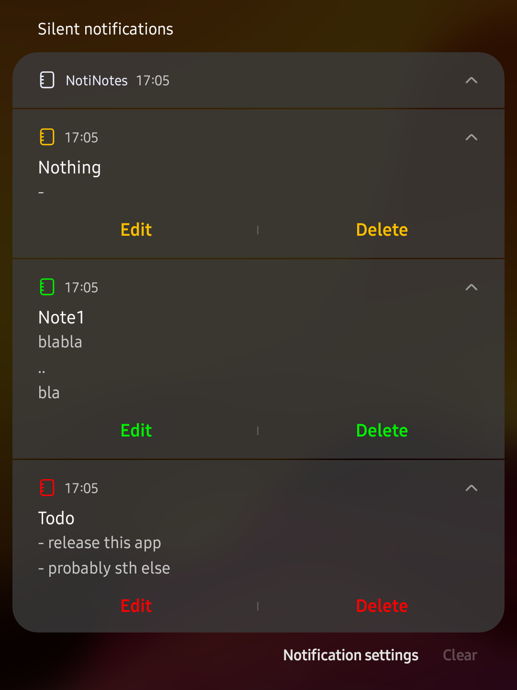
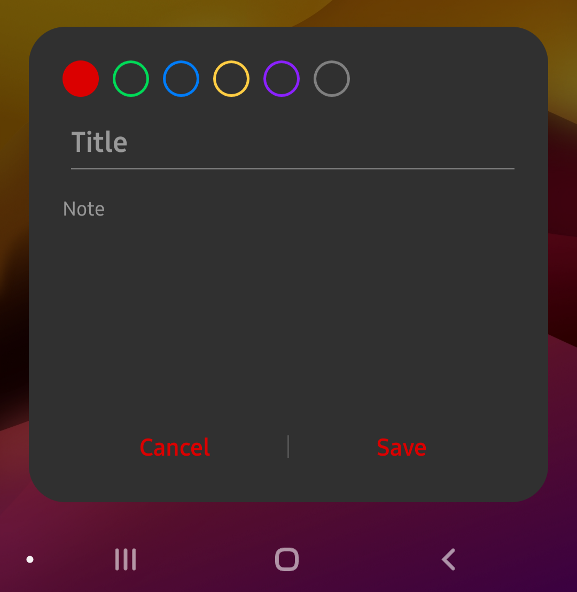
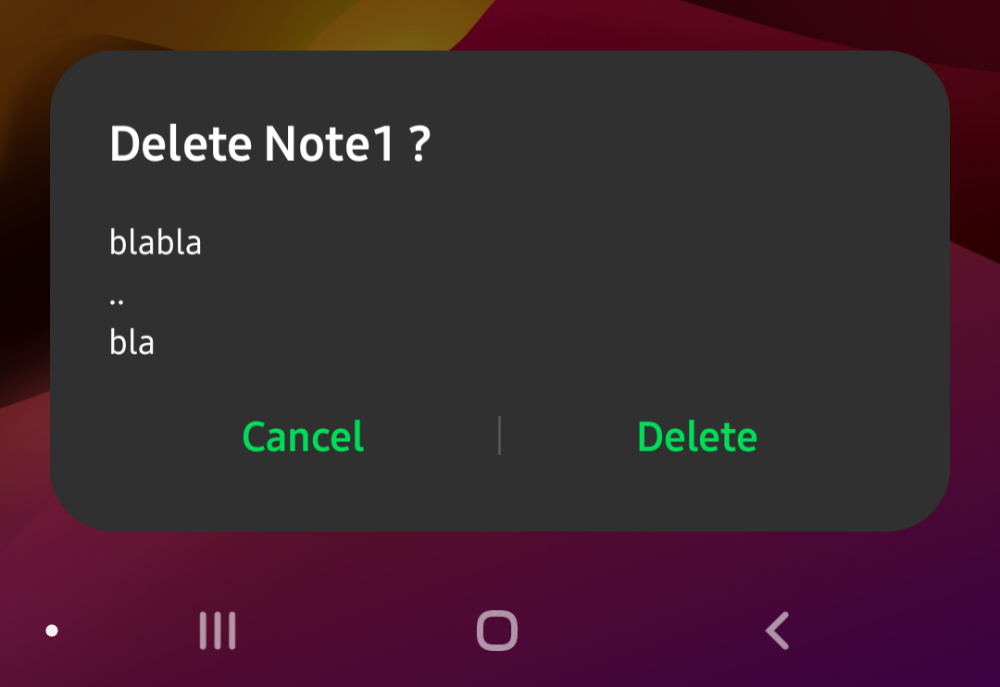
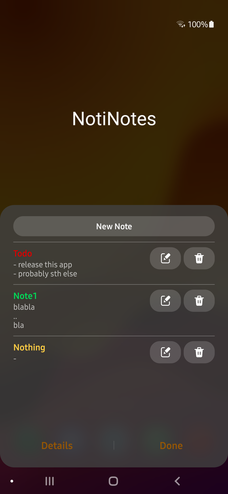

#  NotiNotes

A simple notes app, which only lives in your QS and notification panel. Quickly add, view and edit your notes and show them as notifications. All you need to do is adding the tile in your Quick Settings panel and you're ready to note. You can also change the color of the note for better management and select if it should be hidden on the lockscreen for privacy.

  

### Additionally for Samsung devices:
On Samsung devices this app also has a so called 'Detail View' which shows up when you click the text below the icon, like the wifi and bluetooth tile.

